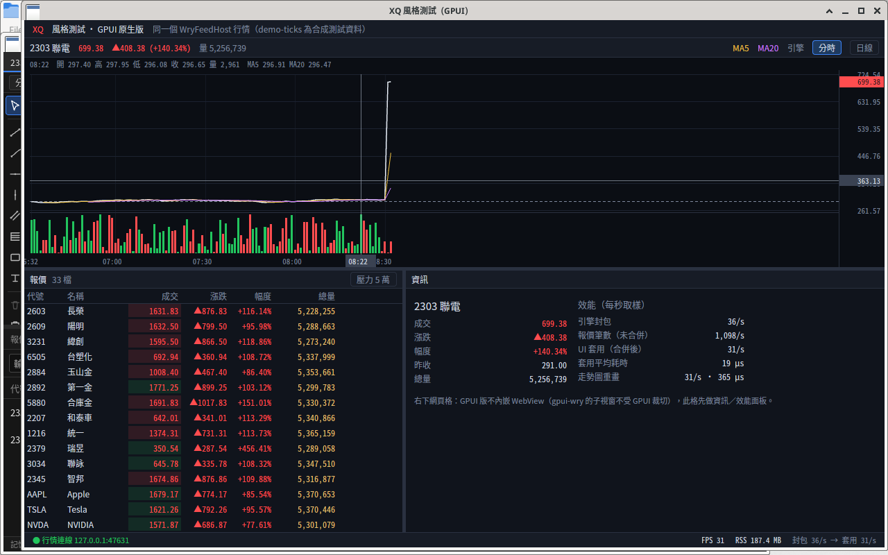
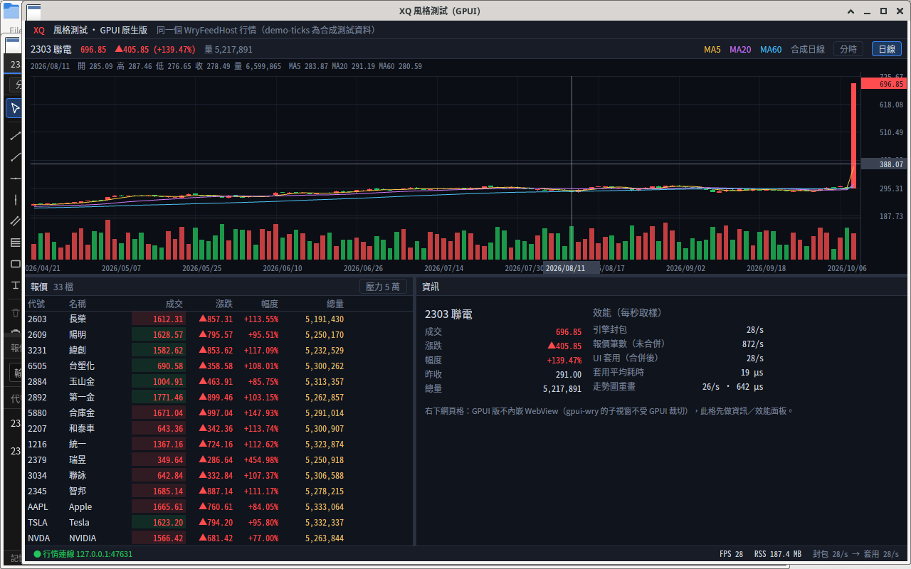
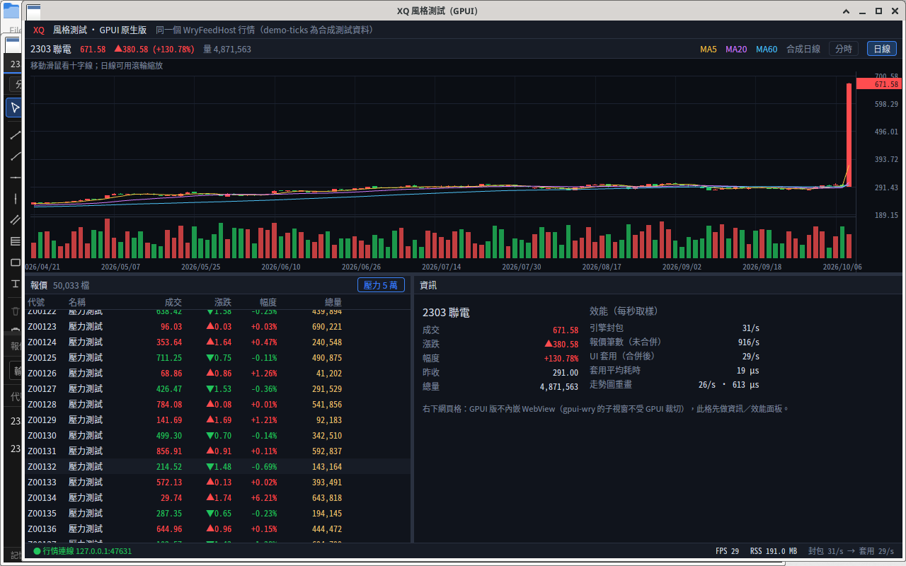
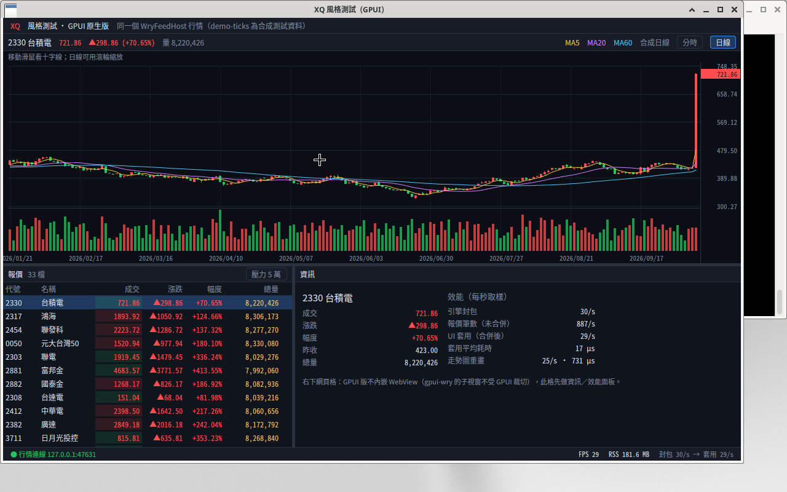
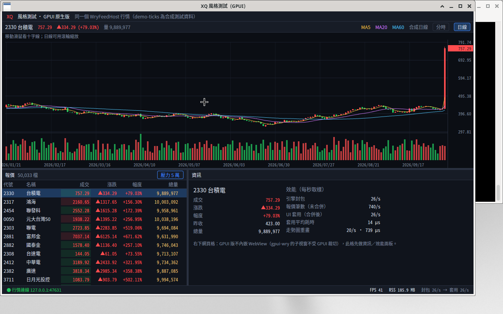

# gpui-xq-demo — XQ 風格看盤（Rust + GPUI 原生繪圖版）

與 [`wry-xq-demo`](https://github.com/tina-moneydj/wry-xq-demo)（tao + wry，HTML/JS 畫面）**接同一個行情來源**：
`WryFeedHost`（.NET，`127.0.0.1:47631`，little-endian 封包）。差別是這版整個主畫面都用 GPUI 原生繪圖，不用 WebView。



| 日線（合成）＋MA5/20/60＋成交量 | 壓力 5 萬列（虛擬化） |
|---|---|
|  |  |

## 功能

- 版面：上＝走勢圖、左下＝報價表、右下＝資訊／效能格；**上下、左右分隔線都可拖曳**。
- 報價表：代號／名稱／成交／漲跌／幅度／總量，**漲紅跌綠**，成交價底色顯示上一筆 tick 方向；
  `uniform_list` 虛擬化，按「壓力 5 萬」加 5 萬列合成資料測試捲動與記憶體。
- 走勢圖（canvas 自繪，**高頻看盤取向：每筆 tick 只增量更新最後一根，不整段重算**）：
  - 週期：**分時／日K／週K／月K**。分時＝引擎 `intraday` 快照＋`minutes` 增量分鐘線、昨收虛線；
    日 K 與 wry 版相同做法「合成 1200 根日 K、最後一根跟著現價」，週／月 K 由日 K 聚合。滾輪縮放、拖曳平移、「重設縮放」。
  - **主圖疊加（最多 20 個、可重複、可調參數）**：MA、EMA、布林通道（n, k）、SAR（step, max）。
  - **副圖（最多 10 個，共用時間軸）**：成交量（＋均量 MA5/20）、KD、MACD（DIF／MACD／OSC 柱）、RSI、威廉 %R、DMI（+DI／−DI／ADX）、ATR、OBV。
    「指標 ▾」選單：疊加 ±參數／刪除／新增，副圖勾選與參數 ±。
  - 指標都保存「每一根的遞迴狀態」（EMA、Wilder 平滑、SAR、KD…），跳價只重算最後一根，結果與整段重算一致（有單元測試）。
  - **畫線工具（左側工具列）**：趨勢線、射線、水平線、垂直線、平行通道、費波納契、矩形、文字；點選取、拖曳整條或控制點、
    Delete 刪除、全部清除、Esc 取消、雙擊文字可改字。
  - **畫線層效能**：幾何快取＋64px 格狀空間索引 hit-test、只建可見範圍（含平移預留）、平移時整批頂點位移不重建、
    只有尺度（價格範圍／K 寬／版面）或內容改變才重建。
  - 三個分層 cached view：主圖層（K 棒＋指標）、畫線層、即時層（圖例＋十字線＋選取中的畫線）；滑鼠移動只重畫即時層。
  - 十字線＋游標所在 K 棒的開高低收量與每個指標讀值（疊加圖例自動換行）。
  - **存檔**：每個「代號｜週期」的指標設定與畫線寫到 `~/.local/share/gpui-xq-demo/state.json`（`XQ_GPUI_STATE` 可改路徑；新代號沿用上次指標設定）。
  - 點報價列切換走勢圖代號（重新訂閱 `chart` 代號）。
- 狀態列：連線狀態、FPS、RSS（每秒取樣）、引擎封包數→UI 套用次數。

右下的「網頁格」**不在範圍內**：GPUI 沒有官方 WebView；`gpui-wry` 的子視窗畫在 GPUI 之上、不受 ContentMask 裁切
（舊測試程式保留在 `legacy/gpui_wry_window_test.rs`，不參與編譯）。此格先放資訊與效能數字。

## 建置／執行

```bash
export PATH="$HOME/.cargo/bin:$PATH"
cargo build --release            # rust-toolchain.toml 用 stable（GPUI 依賴 oo7 需要 rustc ≥ 1.92）
DISPLAY=:2 XQ_METRICS=1 ./target/release/gpui-xq-demo
cargo test --release --workspace # 協議切包／解碼、指標增量＝整段重算、週／月聚合測試
```

環境變數：

| 變數 | 用途 |
|---|---|
| `XQ_FEED_ADDR=127.0.0.1:47631` | 改行情位址（預設 47631） |
| `XQ_METRICS=1` | 每秒在 stderr 印 fps / rss / 封包數 / 套用耗時 |
| `XQ_NO_VIEW_CACHE=1` | 關掉 view cache（比較用） |
| `XQ_DEBUG=1` | 印滑鼠事件等除錯訊息 |
| `XQ_PERIOD=D` | 啟動週期：`T` 分時（預設）／`D` 日K／`W` 週K／`M` 月K |
| `XQ_TOP_FRAC=0.56` | 上方走勢圖佔比（重圖表壓測用 0.811，讓走勢圖面與 wry 版同為 1166×512） |
| `XQ_GPUI_STATE=路徑` | 存檔位置（預設 `~/.local/share/gpui-xq-demo/state.json`；`XQ_BENCH`／`XQ_CHART_STRESS` 時不讀不寫） |
| `XQ_CHART_STRESS=1` | 重圖表壓測（與 wry 版同流程）：等第一筆報價 → 20 疊加＋8 副圖＋1000 畫線（`XQ_CHART_DRAWINGS`）→ 暖身 `XQ_CHART_WARM_MS`（3000）→ ticks／crosshair／pan 各 `XQ_CHART_PHASE_MS`（10000），結果印 `CHARTPERF|{json}`（FPS、各層平均 paint ms、RSS） |
| `XQ_LAYER_MODE=split` | 實驗：圖層改成 quad／path／字分開（預設每層一個 scene layer，lavapipe 上較快） |
| `XQ_BENCH=1` | 第一幀／第一筆報價畫出後各印一行 `BENCH ...`（給 `scripts/bench-main-window.sh` 打時間戳） |
| `XQ_GROUP_STRESS=1` | 壓測：1.2 秒後開 5 萬列＋合成跳價（`XQ_STRESS_TICK_HZ`，預設 3000 筆/s）`XQ_STRESS_TICK_MS`，再邊跳價邊捲動 `XQ_STRESS_SCROLL_MS`（預設各 2000 ms），結果印 `GROUPPERF|{json}` |

Linux 需要 Vulkan（或 GL）驅動；沒有 GPU 的機器裝 Mesa lavapipe：`sudo apt install mesa-vulkan-drivers vulkan-tools`。

> **WryFeedHost 只接受一個 client（後連者勝）**。GPUI 版和 wry 版同時開會互搶連線（各自 500ms 重連），
> 測試時先暫停另一個：`kill -STOP <wry pid>`，測完 `kill -CONT <wry pid>`。

## 架構

```
crates/xq-feed      ← 共用協議 crate（零依賴）：Subscribe 編碼、FrameReader 切包、型別化 decode、背景連線/重連執行緒
src/bridge.rs       ← 背景執行緒 → UI 的合併層（Inbox）
src/table.rs        ← 報價表 view（uniform_list）
src/chart.rs        ← 走勢圖 view：三個 cached 繪圖層、左側畫線工具列、指標選單、事件、XQ_CHART_STRESS 壓測驅動
src/model.rs        ← 走勢圖狀態：版面（與 wry 同公式）、視圖、互動（畫線／拖曳／平移）、畫線快取鍵
src/indicators.rs   ← 主圖疊加（MA/EMA/BB/SAR）與副圖（VOL/KD/MACD/RSI/%R/DMI/ATR/OBV），每根保存遞迴狀態 → 增量更新
src/drawings.rs     ← 畫線資料（JSON 與 wry 相容）、幾何、hit-test、空間索引、幾何／圖元快取
src/gfx.rs          ← 自己的線段三角化（不靠 lyon）、quad／文字小工具
src/store.rs        ← 指標設定與畫線存檔（背景寫檔）
src/series.rs       ← K 線序列、合成日 K（1200 根）、週／月聚合
src/main.rs         ← Terminal 根 view：版面、分隔線、狀態列、資訊格、FPS/RSS 取樣
```

資料流：

1. `xq-feed` 背景執行緒讀 TCP → `FrameReader` 切包（半包保留）→ `decode` 成 `Msg`（不經 JSON）。
2. `bridge::merge` 在背景執行緒 O(1) 合併進 `Inbox`：**同代號報價只留最新**、分時快照只留最新、同分鐘的分鐘線只留最新。
   只有 Inbox 從空變非空時才送一次喚醒訊號。
3. UI 端一個 async task：被喚醒 → `take()` 整包取走 → 套用 → **睡 16ms 再收下一次**，所以引擎推再快 UI 最多 ~60 次/秒套用。
4. 套用只改有變的列（價／量相同就跳過），只有實際變動的 view 才 `notify`。
5. 報價表／走勢圖／資訊格是三個獨立 entity，用 `.cached()` 掛在根 view 下：報價 tick 只重畫報價表的**可見列**，
   走勢圖只有目前代號有 tick 時才重畫；字串只在 render 時為可見列格式化（5 萬列不預先建字串）。
6. 走勢圖狀態放在 `Rc<RefCell<Model>>`，三個繪圖層共用；tick 只改最後一根、每個指標只算最後一根，
   新分鐘才 append。換代號／週期／指標設定才 O(n) 重建一次。tick 只通知主圖層與即時層，
   畫線層只有在可見價格範圍改變時才重建（平移只位移）。每層包成一個 scene layer，讓 GPUI 每層只做一次 path 光柵批次。

## 效能數字（本機 box：8 核、無 GPU、Mesa lavapipe 軟體 Vulkan、Xvfb 1280×800，demo-ticks 行情；初版量測，完整對照見下一節）

| 項目 | GPUI 版 | wry 版（同時段量測） |
|---|---|---|
| RSS（全部行程） | **≈ 184–196 MB**（單一行程） | 533 MB（主程式 85 + WebKitWebProcess 430 + Network 18）；先前量測右下空白時 615–650 MB |
| 加 5 萬列壓力資料 | +≈ 4.5 MB（191 MB） | — |
| 引擎封包 | 約 30–38 包/s、900–1,200 筆報價/s | 同一來源 |
| UI 套用 | 與封包數相同（≤ 60/s 上限），平均 **17–24 µs**/次 | — |
| 走勢圖 paint（CPU 端組 scene） | 分時 ≈ 0.3 ms、日線 ≈ 0.6–0.7 ms | — |
| FPS | 27–36（跟著 tick 頻率；無變動時不重畫） | — |
| CPU | ≈ 235%（**幾乎都是 lavapipe 軟體光柵**；有實體 GPU 時會低很多） | — |

注意：FPS 上限在這台機器上同時受「行情 ~30 包/s」與「lavapipe 軟體光柵每 frame 約 30ms」限制；
CPU 端每 frame 的工作（套用＋組 scene）不到 1 ms。

## 主視窗成本比較（wry vs GPUI）

同一個行情來源、同一份畫面內容，各開**一個主視窗**的成本。對照專案：[tina-moneydj/wry-xq-demo](https://github.com/tina-moneydj/wry-xq-demo)（tao + wry 版）。

- **測試日期**：2026-10-08（Asia/Taipei 12:24–12:35）；每個情境兩邊各跑 **3 次取中位數**，兩個程式輪流跑（WryFeedHost 一次只服務一個 client）。
- **環境**：Linux box（Debian 13，kernel 6.12，8 vCPU Intel Xeon，**沒有 GPU**），Xvfb `:2` 1280×800＋xfwm4（X11）。
  wry 版＝WebKitGTK 2.54（`WEBKIT_DISABLE_COMPOSITING_MODE=1`）；GPUI 版＝`gpui-pre 0.3.7` 走 Vulkan，由 **Mesa 25.0.7 lavapipe 軟體光柵**。
  行情：`WryFeedHost --demo-ticks`（合成資料，約 30 包／900 筆報價每秒），測前重啟過 feedhost。兩邊都是 release build。
- **同樣的畫面**：視窗 1200×720、33 檔自選（同 `gpui-xq-demo/src/names.rs`）、單一走勢圖＝**2330 日線（合成日 K）＋MA5/20/60＋成交量**、
  左下報價表 6 欄（代號／名稱／成交／漲跌／幅度／總量）、右下空白（wry 是 `about:blank`，**不建子 WebView**；GPUI 是資訊格）、不開壓力 5 萬。
  wry 的 `state.json` 測試時換成同內容的最小設定（1 個走勢分頁、左下只有「組合」分頁），測完還原。
- **方法**（[`scripts/bench-main-window.sh`](scripts/bench-main-window.sh)，可重跑：`scripts/bench-main-window.sh 3 all`）：
  - 啟動：launch → 視窗出現（`xdotool` 輪詢）→ 第一幀畫完／第一筆報價畫上畫面（程式在 `XQ_BENCH=1` 時印 `BENCH first-frame`／`BENCH first-quote`，腳本收到時打時間戳）。
  - 記憶體：主行程＋所有子行程（wry：`WebKitWebProcess`、`WebKitNetworkProcess`）的 RSS，以及 PSS（`/proc/*/smaps_rollup`，共用函式庫按比例分攤，比較公平）。
  - CPU：所有行程（含所有執行緒）`utime+stime` 在 30 秒內的平均；100% = 一顆核心。另外依執行緒名稱拆出「軟體光柵（`llvmpipe` 執行緒）」佔多少。
  - FPS：程式自己回報（wry：狀態列 rAF 計幀；GPUI：每秒實際畫出的 frame 數），取 30–60 秒平均。

### 一般情境（開一個主視窗、行情持續跳動）

| 項目（中位數，3 次） | wry（tao + wry / WebKitGTK） | GPUI（原生繪圖） |
|---|---|---|
| 啟動 → 視窗出現 | 228 ms | 261 ms |
| 啟動 → 第一幀畫完 | 986 ms | **285 ms** |
| 啟動 → 第一筆報價上畫面 | 917 ms¹ | **398 ms** |
| RSS 合計，t=10s | 600 MB | **182 MB** |
| RSS 合計，t=60s | 674 MB（主程式 195＋WebKitWebProcess 413＋Network 60）² | **182 MB**（單一行程） |
| PSS 合計，t=10s / t=60s | 414 / 477 MB | **178 / 178 MB** |
| 行程數／執行緒數 | 3／80 | **1／53** |
| CPU（30 秒平均，全部行程） | **181%** | 246% |
| 　└ 其中軟體光柵（llvmpipe 執行緒）³ | ≈ 102% | ≈ 224% |
| 　└ 扣掉軟體光柵（程式本身＋瀏覽器引擎）³ | ≈ 79%（WebKit 主執行緒 65%、wry 主程式 8%） | **≈ 22%** |
| FPS（程式回報） | 59.5（rAF 計幀，不代表每幀都有重畫） | 27.7（實際畫出的幀；被 lavapipe 每幀約 30 ms 卡住） |
| 執行檔大小 | **1.6 MB**（另需系統 WebKitGTK 4.1：`libwebkit2gtk` 96 MB＋`libjavascriptcoregtk` 33 MB；Windows 用系統 WebView2，安裝檔 3.1 MB） | 25.1 MB（單一執行檔，strip＋thin LTO；只需 Vulkan/GL 驅動） |

¹ wry 的第一筆報價和第一幀幾乎落在同一幀（兩個標記都是「兩次 rAF 後」送出，順序會互換）。
² wry 的 RSS 在開頭 60 秒內會從 600 爬到 674 MB（JS heap／WebKit 快取暖身）；GPUI 從第 10 秒起就持平。
³ 執行緒拆分取第 3 次的數字。

### 壓力情境（5 萬列報價表＋高頻跳價＋捲動）

兩邊都開 **5 萬列合成表、6 欄**，每秒 **3000 筆合成跳價**（30 Hz 分批、隨機挑列，同 wry 版 `applyTicks`），
先只跳價 **30 秒**、再邊跳價邊上下正弦捲動 **10 秒**；行情 feed 照常進來。
wry：`XQ_GROUP_STRESS=1 XQ_STRESS_COLS=6 XQ_STRESS_TICK_MS=30000 XQ_STRESS_SCROLL_MS=10000`；
GPUI：`XQ_GROUP_STRESS=1`（同一組 `XQ_STRESS_*` 參數），結果都以 `GROUPPERF|{json}` 印出。

| 項目（中位數，3 次） | wry | GPUI |
|---|---|---|
| RSS／PSS，跳價 30 秒時（約 t=32s） | 623／426 MB | **187／183 MB**（比一般情境只多 ≈ 4 MB） |
| RSS／PSS，捲動中（約 t=40s） | 647／456 MB | **186／183 MB** |
| CPU，跳價 30 秒 | **171%** | 298%（其中 llvmpipe ≈ 272%） |
| CPU，捲動 10 秒 | **192%** | 305% |
| FPS，跳價中 | 59.5（rAF） | 35.8（實際幀） |
| FPS，捲動中 | 59.7（rAF） | 35.5（實際幀） |
| 捲動卡頓（幀間隔 > 32 ms） | 1 次（平均 35 ms） | 140 次（平均 33.1 ms，即穩定 ~30 fps 的幀距） |
| 可見格更新，跳價中 | 0.36 ms／次、約 1 格／次（只重畫髒列；30 秒 769 次） | **0.09 ms**／次、84 格／次（整個可見範圍重建；30 秒 1074 次） |
| 可見格更新，捲動中 | 1.15 ms／次、120 格／次（10 秒 834 次） | **0.09 ms**／次、84 格／次（10 秒 355 次） |

兩邊的差異（盡量對齊，但仍不完全相同）：
- 表格內容：wry 是純合成組合（50,000 列）；GPUI 是 33 檔真實自選＋50,000 合成列（最上面是真實列）。
- 更新策略：wry 只重畫「可見且有變」的格；GPUI 每次表格有變就重建整個可見範圍（14 列×6 欄），但每次只要 ~0.09 ms。
- 「可見格更新」只算組資料的時間：wry＝JS 組 DOM 字串＋`innerHTML`；GPUI＝建立可見列的元素樹。都**不含**版面計算與光柵化。
- 捲動驅動：wry 用 rAF（跟顯示同步）；GPUI 用 16 ms 計時器。可見列數：wry 約 20 列（含 overscan）、GPUI 14 列。
- FPS 定義不同（見上表）。

### 結論

- **記憶體**：GPUI 版約是 wry 版的 **1/3.7（RSS 182 vs 674 MB）**，PSS 也只有 **~37%**（178 vs 477 MB），而且只有一個行程、不隨時間增長；
  5 萬列壓力表對兩邊都不太加記憶體（虛擬化），GPUI 只多約 4 MB。
- **啟動**：視窗出現時間差不多（~0.25 s），但 GPUI **~0.3 s 就畫出內容**、0.4 s 有報價；wry 要等 WebKit 子行程起來、載入 HTML/JS，約 **0.9–1.0 s**。
- **CPU／FPS（這台沒有 GPU）**：GPUI 看起來比較吃 CPU、FPS 也較低，原因是 lavapipe 用 CPU 光柵化**整個視窗每一幀**（佔它 CPU 的 ~90%）；
  扣掉軟體光柵，GPUI 本身只用 **~22%**，wry（WebKit 主執行緒＋主程式）約 **~79%**。有實體 GPU 時 GPUI 的光柵化交給 GPU，CPU 與 FPS 會大幅改善；
  wry 在 Windows／macOS 也會改用 GPU 合成，數字同樣會不同。
- GPUI 表格還能再省：只在跳價的列落在可見範圍時才 `notify`（wry 版已經這樣做）。

### 注意事項

- 這是**沒有 GPU 的 Linux／Xvfb**：兩邊都靠 Mesa 軟體光柵（WebKit 也有 ~100% 的 `llvmpipe` 執行緒）。Windows（WebView2／DirectX）、macOS（WKWebView／Metal）的絕對數字會不同，請在目標機器重跑。
- wry 的 FPS 是 rAF 回呼次數（主執行緒沒被卡住就接近 60），GPUI 的 FPS 是實際畫出的幀數（沒變化就不畫），**兩者不能直接比**；看卡不卡要對照捲動卡頓與 CPU。
- demo-ticks 價格有向上漂移，測試約 25 分鐘內 2330 漲了 ~70%（假資料特性，不影響成本量測）。
- RSS 會重複計算共用函式庫（WebKit 三個行程共用很多 .so），所以同時列 PSS。
- 截圖（t≈60s／壓力跳價中）：

| wry | GPUI |
|---|---|
|  |  |
|  |  |

原始數據：[`docs/bench/summary.json`](docs/bench/summary.json)、[`docs/bench/results.json`](docs/bench/results.json)。

### 重圖表壓測（1000 畫線＋多指標）

上面兩個情境的走勢圖都很輕（MA×3＋成交量）。這一節把**同一個主視窗**的走勢圖塞到最重，比較看盤畫面最吃資源的情況。

- **測試日期**：2026-10-08（Asia/Taipei 13:15–13:19）；兩邊各跑 **3 次取中位數**，輪流跑（WryFeedHost 一次只服務一個 client），量測前重啟過 feedhost（避免 demo 價格漂移）。
- **環境**：同上（8 vCPU、**沒有 GPU**、Xvfb `:2`、WebKitGTK 2.54 `WEBKIT_DISABLE_COMPOSITING_MODE=1` Canvas 2D／`gpui-pre 0.3.7` wgpu → Mesa lavapipe），release build，視窗 1200×720。
- **同樣的負載**（兩邊同一套定義，GPUI 版照 wry `__perfSetupStress`／`__perfAddN`／`__perfContinuous` 移植）：
  - 2330 **日 K 1200 根**（合成，最後一根跟著現價）。
  - **主圖疊加 20 個**：MA×11（5、10、15、20、25、30、40、50、60、120、7）、EMA×5（8、12、21、26、55）、布林×2（20,2／50,2.5）、SAR×2（0.02/0.2、0.04/0.3）。
  - **副圖 8 個**共用時間軸：成交量＋均量 MA5/20、KD、MACD、RSI、威廉 %R、DMI、ATR、OBV。
  - **畫線 1000 筆**，同一個產生公式：趨勢線 40%、射線 8%、水平線 8%、垂直線 8%、平行通道 12%、費波納契 12%、矩形 6%、文字 6%。
  - **走勢圖 canvas 同為 1166×512**：1200×720 的預設上下比例下，20 個疊加的圖例＋8 個副圖會把主圖擠到只剩幾個像素，所以兩邊都把上方走勢圖放大
    （wry `XQ_CHART_TOP_RATIO=0.8`、GPUI `XQ_TOP_FRAC=0.811`；實際尺寸兩邊都在 `CHARTPERF setup` 印出確認）。
- **流程**（`XQ_CHART_STRESS=1` 自動執行）：等第一筆真實報價 → 300 ms 後套用上述負載（印 `BENCH heavy-frame`）→ 暖身 3 秒 → 三段各 **10 秒**：
  - **ticks**：每一幀跳一筆合成價（`最後收盤 + sin(f/7)×0.15`、量 +1），所有指標更新最後一根；
  - **crosshair**：跳價＋十字線依公式移動（`x = 80 + 13f mod (w−160)`、`y = 40 + 7f mod (h/2)`）；
  - **pan**：跳價＋十字線＋視圖左右正弦平移 ±12 根（拖曳中、價格軸凍結）。
- **量測**（[`scripts/bench-main-window.sh`](scripts/bench-main-window.sh) `heavy` 模式：`GPUI_TOP_FRAC=0.811 scripts/bench-main-window.sh 3 heavy`）：
  各段的 CPU（所有行程所有執行緒；另外扣掉 `llvmpipe` 軟體光柵執行緒）、各段第 5 秒的 RSS／PSS（全部行程）、
  程式回報的 FPS 與平均走勢圖繪製耗時（`CHARTPERF|{json}`）、啟動到第一個重圖表幀的時間。

| 項目（中位數，3 次；ticks／crosshair／pan） | wry（WebKitGTK Canvas 2D） | GPUI（原生繪圖） |
|---|---|---|
| 啟動 → 第一筆報價上畫面 | 913 ms | **405 ms** |
| 啟動 → 第一個重圖表幀（等報價＋300 ms＋套用負載） | 1,294 ms | **763 ms** |
| RSS 合計 | 685／703／804 MB（3 個行程） | **219／220／223 MB**（1 個行程） |
| PSS 合計 | 498／516／617 MB | **215／216／219 MB** |
| CPU 合計（100% = 一顆核心） | **249％／249％／285％** | 413％／422％／412％ |
| 　└ 其中 `llvmpipe` 軟體光柵 | ≈ 113％／117％／171％ | ≈ 376％／378％／377％ |
| 　└ 扣掉軟體光柵 | 136％／132％／110％（`WebKitWebProcess` 同名執行緒合計 ≈ 120％） | **37％／38％／36％**（`gpui-xq-demo` 同名執行緒合計 ≈ 34％） |
| FPS（程式回報，定義不同見下） | **31.7／31.9／23.9**（rAF 次數） | 20.6／20.7／20.5（實際畫出的幀） |
| 平均走勢圖繪製（每幀，定義不同見下） | 6.8／7.3／8.2 ms（`render()`，含 Canvas 2D 光柵） | **3.0／3.1／2.2 ms**（三層 CPU 端組圖元，不含光柵） |

GPUI 三層的細項（中位數那次）：主圖層 ≈ 1.2 ms／幀；畫線層 ≈ 1.1 ms（跳價改到可見價格範圍時重建可見的 ~193 筆，≈ 9,900 個頂點）、
平移時 ≈ 0.47 ms（只整批位移、不重建）；即時層（圖例＋十字線）≈ 0.6 ms。

**結論**

- **記憶體**：GPUI 約是 wry 的 **1/3**（RSS 219 vs 685–804 MB、PSS 215 vs 498–617 MB），而且三段幾乎不增長；wry 在平移段又多了約 100 MB（推測是 JS 物件／畫布暫存）。
- **啟動**：GPUI 0.76 s 就畫出完整重圖表，wry 要 1.29 s（多半是 WebKit 子行程與 HTML/JS 載入）。
- **CPU 端的繪圖工作**：GPUI 扣掉光柵只用 **~35%**，每幀組圖元 2–3 ms（指標全部增量、畫線分層快取＋平移位移＋可見範圍裁切）；
  wry 扣掉光柵約 **110–136%**（大多在 WebKitWebProcess）、每幀 `render()` 7–8 ms。
- **FPS（這台沒有 GPU）**：ticks／crosshair 時 **wry 較高（≈ 32 vs 21）**，pan 時差距縮小（24 vs 20.5）。GPUI 三段 FPS 幾乎一樣、
  CPU 端也只用一小部分時間，瓶頸是 **lavapipe 每一幀用 CPU 光柵化整個視窗**（≈ 3.8 顆核心；GPUI 的 path 還要先畫到 4× MSAA 中介貼圖）；
  wry 每幀只需重畫走勢圖 canvas 那一塊（Cairo 在 CPU 上畫）。換成有實體 GPU 的機器，GPUI 的光柵化會交給 GPU，FPS 應該會大幅提升，但**這台機器沒辦法驗證，需在目標機器重跑**。

**注意事項**

- **FPS 定義不同**：wry＝`__perfContinuous` 的 rAF 回呼次數（每次回呼同步跑完 `render()`，WebKit 之後才合成上畫面）；
  GPUI＝根 view 實際畫出的幀數（壓測用 `on_next_frame` 每幀驅動一步）。
- **繪製耗時定義不同**：wry 的 `render()` 包含 Canvas 2D（Cairo）實際光柵化；GPUI 只算三層 paint 在 CPU 端組 quad／path／文字的時間，光柵在 `llvmpipe` 執行緒，**不含在內**。
- **畫面放大**：兩邊都把上方走勢圖放大到同樣的 1166×512（見上），跟前兩個情境的版面比例不同。
- **合成 K 線不完全一樣**：兩邊都是「合成日 K、最後一根跟現價」，但亂數產生器不同，K 棒數值不同，所以畫線落點、可見價格範圍、畫線層重建次數會有差異
  （GPUI 第 3 次剛好價格範圍沒被跳價改到、畫線層 0 次重建，每幀 2.4 ms，FPS 仍是 20.3 → 再次說明瓶頸在光柵化）。
- GPUI 的日 K 根數為了這個測試從 260 改成 **1200**（與 wry 相同）；前兩節的 GPUI 數字是 260 根時量的。
- wry 平移時走 `lightOnly` 路徑，重型指標的快取會被丟掉、每幀重算；GPUI 所有指標都保存每根的遞迴狀態，平移與跳價都只算最後一根。
- 校正時先用一個跑了 25 分鐘、2330 已漂到 +1000% 的 feed 試跑，wry 只有 15–17 FPS、GPUI 19.5 FPS（價格範圍異常時畫線全擠在一起）；正式量測前已重啟 feedhost。
- 截圖（最後一次、crosshair 段中間）：

| wry | GPUI |
|---|---|
|  |  |

原始數據：[`docs/bench/summary-heavy.json`](docs/bench/summary-heavy.json)、[`docs/bench/results-heavy.json`](docs/bench/results-heavy.json)。

## 平台狀態（GPUI）

- **macOS**：GPUI 的主平台（Zed 編輯器），Metal 繪圖，最成熟。
- **Windows**：已有官方支援（DirectX 11 / DirectComposition），Zed Windows 版已釋出；中文輸入法、HiDPI 要實測。
- **Linux**：X11 與 Wayland 都支援，這個版本（`gpui-pre 0.3.7`）繪圖走 wgpu（Vulkan 為主）；需要可用的 Vulkan/GL 驅動。
- **iOS / iPadOS / Android**：GPUI **不支援**行動平台；全平台要另做行動端（共用 `xq-feed` 協議／Rust 核心）。
- 依賴：`gpui-pre` 是社群發佈的 Zed GPUI 快照（crates.io 上官方 `gpui` 0.2.x 版本較舊），API 仍在變動，版本鎖在 `=0.3.7`。

## 跟 wry 版相比還沒做的

- 右下嵌網頁（Yahoo 等）、多分頁、安裝檔。
- 畫線樣式（顏色／線寬）、畫線複製、指標顏色自訂。
- 自選清單編輯、搜尋代號。
- `xq-feed` 已抽成獨立 crate；wry 版目前仍用自己的 `src/engine.rs`（同格式），之後可改成 path/git 依賴共用同一份實作。

## 已知行情來源問題（不是這個程式的 bug）

`WryFeedHost --demo-ticks` 的隨機漫步有向上漂移（每 tick 期望 +0.003%，40 次/s），跑久了價格會一路漲；
跑了數小時的 2330/2317/2454/0050 已經溢位成 ±21474836.48（`int` 分），表格顯示 `--`、走勢圖會忽略這種報價。
重開 feedhost 即可恢復正常數值。
